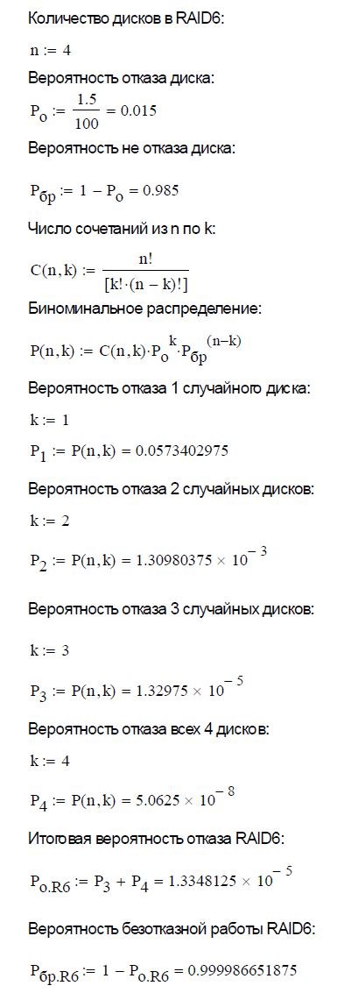

## Введение

Настоящий документ является структурированным отчетом с подробным описанием выполняемых действий в процессе решения ДЗ по лекции "Хранение данных в LInux". Выполнены Часть 1 и Часть 2. 

Часть 1 выполена на ОС Windows 10 в Mathcad 15, Часть 2 выполнена на ОС Ubuntu 24.04.2 LTS:


## Задание

1. Посчитать вероятность отказа RAID6. Количество дисков - 4. Вероятность отказа диска - 1.5 %.
2. Вам надо загрузиться из образа и попасть в ОС. В этом образе лежат важные данные в каталоге /mnt. К сожалению, образ сохранился неправильно, и после загрузки оказалось, что рейд с важными данными не поднялся. Ваша задача — добыть данные.

## Решение

### Часть 1. Вероятность отказа RAID6

Известно, что RAID6 использует двойную четность, что позволяет выдержать одновременный отказ до двух дисков без потери данных. При отказе двух дисков массив останется доступным в деградированном режиме. Если выйдет из строя 3 и более дисков, то массив разрушится и данные будут потеряны.



Ответ: 1.3348125 × 10<sup>-5</sup>

### Часть 2.  Добыть данные

Устанавливаю qemu-system-x86:

```sudo apt install qemu-system-x86 -y```

Запускаю виртуальную машину:

```qemu-system-x86_64 -M q35 -m 2048 -nographic -drive file=noble-server-cloudimg amd64.img,format=qcow2,if=virtio```

Замечаю сбой монтирования /mnt в процессе загрузки системы:


Авторизируюсь в системе:

```
ubuntu login: ubuntu
Password: ubuntu
```

Убеждаюсь, что директория /mnt пуста:


Проверяю файл /etc/fstab и вижу, что /mnt - точка монтирования RAID /dev/md0, тип файловой системы - ext4:


Проверяю состояние RAID и вижу, что RAID не собран:


Собираю RAID вручную (на 2 дисках из 4):


Еще раз проверяю состояние RAID и убеждаюсь, что массив - RAID10 и он находится деградированном, но работоспособном состоянии:


Монтирую /dev/md0 в /mnt и получаю ошибку:


Оцениваю состояние файловой системы без внесения изменений и обнаруживаю проблемы с суперблоком, а также счетчиками блоков и inodes:


Запускаю режим автоматического исправления ошибок:


Монтирую /dev/md0 в /mnt и проверяю:


Проверяю содержимое директории /mnt:


Содержимое important.txt:

```
Your key: BYeQNSqfo7AWXgpNSHIu
```