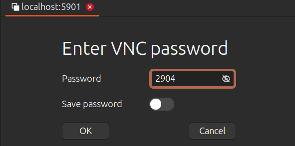
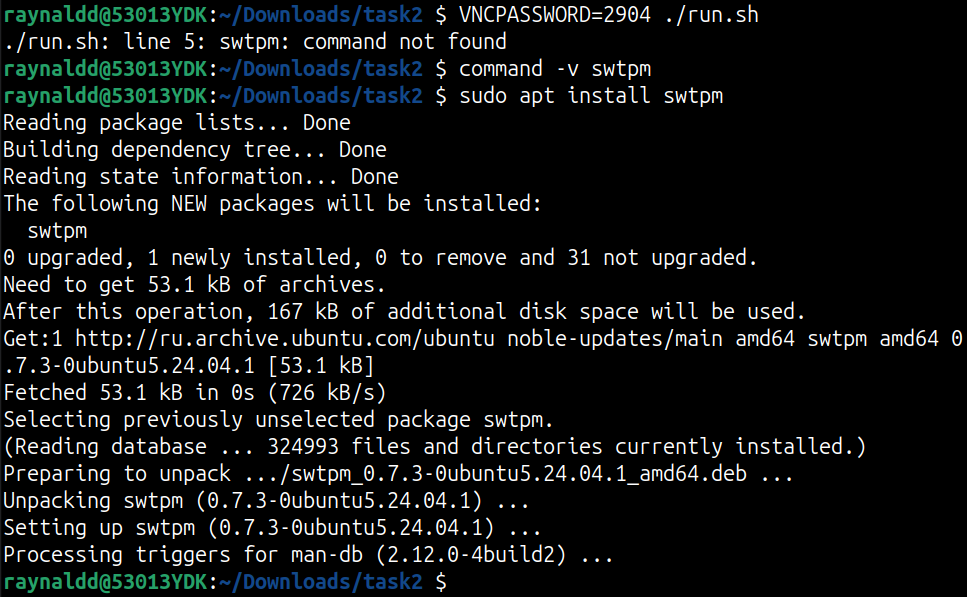

## Введение

Настоящий документ является структурированным отчетом с подробным описанием выполняемых действий в процессе решения ДЗ по лекции "Устройство и загрузка современного сервера". Выполнены Часть 1 и Часть 2. 

ДЗ выполнено на ОС Ubuntu 24.04.2 LTS:


## Задание

1. Дан образ машины, в которой перед её выключением было затёрто начало диска, и она теперь не загружается. Пароль пользователя неизвестен. Нужно восстановить работоспособность системы и суметь в неё залогиниться.
2. Найти и получить секрет.

## Решение

### Часть 1. Восстановить систему

Запускаю скрипт run.sh согласно README и получаю ошибку отсутствия systemrescue-12.01-amd64.iso:


Скачиваю systemrescue-12.01-amd64.iso, SHA256 checksum и проверяю целостность образа:


Повторно запускаю скрипт run.sh, процесс захватывает текущий терминал:


Иду изучать каждый аргумент команды:

```
qemu-system-x86_64 -smp cores=4,threads=1 \
	-drive if=pflash,format=raw,readonly=on,file=OVMF_CODE_4M.ms.fd \
	-drive if=pflash,format=raw,file=OVMF_VARS_4M.ms.fd \
	-drive file=task2.img,format=qcow2 \
	-m 4096 -machine q35,smm=on \
        -nic user,hostfwd=tcp:127.0.0.1:2222-:22 \
	-vnc :1,password-secret=vncpw -object secret,id=vncpw,file=vncpassword,format=raw \
	-boot menu=on \
	-cdrom systemrescue-12.01-amd64.iso \
	-enable-kvm
```

- **`qemu-system-x86_64`**  
    Запускает эмулятор QEMU для архитектуры x86_64 (64-битные системы).

- **`-smp cores=4,threads=1`**  
    Настраивает SMP (Symmetric Multiprocessing):
    - `cores=4` — 4 физических ядра CPU.
    - `threads=1` — 1 поток на ядро (без Hyper-Threading).  
        Итого: гостевая ОС видит 4 логических процессора.

- **`-drive if=pflash,format=raw,readonly=on,file=OVMF_CODE_4M.ms.fd`**  
    Первый pflash-диск для UEFI-прошивки:
    - `if=pflash` — интерфейс эмуляции флеш-памяти UEFI.
    - `format=raw` — образ в сыром формате.
    - `readonly=on` — доступен только для чтения (защита прошивки).
    - `file=OVMF_CODE_4M.ms.fd` — файл UEFI-прошивки (код).
        
- **`-drive if=pflash,format=raw,file=OVMF_VARS_4M.ms.fd`**  
    Второй pflash-диск для переменных UEFI (NVRAM):
    - Переменные загрузки сохраняются здесь (без `readonly`).
    - `OVMF_VARS_4M.ms.fd` — образ для хранения настроек UEFI.
        
- **`-drive file=task2.img,format=qcow2`**  
    Основной виртуальный жесткий диск:
    - `file=task2.img` — образ диска гостевой ОС.
    - `format=qcow2` — формат QCOW2 (поддержка снимков, сжатия).
        
- **`-m 4096`**  
    Выделяет 4096 МБ (4 ГБ) оперативной памяти для гостевой системы.

- **`-machine q35,smm=on`**  
    Выбирает тип системной платформы:
    - `q35` — современная платформа с PCI Express (аналог Intel Q35 чипсета).
    - `smm=on` — включает System Management Mode (режим управления системой), критично для безопасности UEFI.

- **`-nic user,hostfwd=tcp:127.0.0.1:2222-:22`**  
    Настраивает сеть в режиме пользователя (NAT):
    - `hostfwd=tcp:127.0.0.1:2222-:22` — проброс порта:  
        Хост: `127.0.0.1:2222` → Гость: `22` (SSH).  
        Подключение к гостю: `ssh -p 2222 user@localhost`.
        
- **`-vnc :1,password-secret=vncpw`**  
    Включает VNC-сервер:
    - `:1` — дисплей 1 (порт 5901).
    - `password-secret=vncpw` — использует пароль из объекта `vncpw`.

- **`-object secret,id=vncpw,file=vncpassword,format=raw`**  
    Создает объект с паролем для VNC:
    - `id=vncpw` — идентификатор, связанный с `-vnc`.
    - `file=vncpassword` — файл с паролем в сыром виде (plain text).

- **`-boot menu=on`**  
    Включает меню загрузки при старте:
    - Позволяет выбрать загрузку с HDD, CD-ROM и т.д.
    - Особенно полезно с подключенным `-cdrom`.

- **`-cdrom systemrescue-12.01-amd64.iso`**  
    Подключает ISO-образ как CD-ROM:
    - `systemrescue-12.01-amd64.iso` — загрузочный диск для аварийного восстановления.
- **`-enable-kvm`**
	Включает аппаратное ускорение виртуализации через KVM (Kernel-based Virtual Machine).

Открываю второй терминал, и согласно `-vnc :1,password-secret=vncpw` проверяю, что VNC-сервер слушает на порту 5901:


Устанавливаю remmina для управления запущенной виртуальной машиной (ВМ) по протоколу VNC:

`sudo apt install remmina -y`

Подключаюсь к ВМ:




Обращаю внимание на ошибку загрузки с диска (Ассеss Denied):


Проверяю в Boot Manager Menu включен ли SecureBoot:


Отключаю SecureBoot и перезагружаю систему. 
В меню GRUB выбираю загрузиться с параметрами по умолчанию:


SystemRescue 12.01 загружена, вход в систему выполнен под пользователем root:


Проверяю состояние ssh-сервера:


Проверяю состояние firewall:


Проверяю правила iptables и добавляю правило для SSH:


Устанавливаю пароль для root используя утилиту `passwd`

Подключаюсь с хоста на ВМ по SSH согласно правилу проброса портов при запуске qemu:


Смотрю информацию о дисках:


/dev/sda - интересующий меня проблемный диск

Проверяю таблицу разделов:


Основная таблица повреждена, но резервная копия цела, перехожу к восстанавлению таблицы разделов:

Ввожу gdisk /dev/sda и последовательно выбираю:

1 - Use current GPT

r - recovery and transformation options (experts only)

c- load backup partition table from disk (rebuilding main)

y - подтверждаю изменения

v	- verify disk


p - print the partition table


w	- write table to disk and exit

y - подтверждаю изменения

Смотрю информацию о /dev/sda:


/dev/sda1 - загрузочный раздел с файловой системой vfat

/dev/sda2 - корневой раздел с файловой системой ext4

Оцениваю состояние /dev/sda1 без внесения изменений и обнаруживаю повреждения загрузочного сектора, FSINFO-сектора и FAT-таблиц:


Восстановление файловой системы посредством утилиты fsck.fat не помогло (загрузочный сектор полностью повреждён), пересоздаю файловую систему:


Проверяю /dev/sda2, проблем нет:


Монтирую корневой и загрузочный разделы с жёсткого диска к файловой системе RescueCD:


Проверяю монтирование:


Выполняю chroot в собранную ФС и вижу, что UUID /dev/sda1 отличается от записи в /etc/fstab:


Правлю /etc/fstab:


Устанавливаю GRUB:


Выхожу из chroot.

Размонтирую ФС:


Перезагружаю систему и включаю SecureBoot в Boot Manager Menu.

Войти в систему не удается, так как не знаю пароля.
Перезапускаю ВМ и запускаю меню GRUB:


Нажимаю 'e' и редактирую параметры ядра, заменяя ro на rw init=/bin/bash, и загружаю систему (Ctrl-x):


Вывожу список пользователей, задача - залогиниться под пользователем kit:


Меняю пароль у пользователя kit:


Перезагружаю систему:

`reboot -f`

Система загружается до логина без помощи. Вхожу в систему под пользователем kit:


Проверяю, что SecureBoot включен, а также то, что примонтированы все незакомментированные в исходной системе ФС:


### Часть 2. Найти и получить секрет

Выключаю ВМ.

Расскомментирую строки в run.sh, содержащие `swtpm`, и иду изучать значения этих строк.

```
pgrep swtpm >/dev/null || swtpm socket --tpmstate dir=tpm/ --ctrl type=unixio,path=tpm/swtpm-sock --tpm2 -d
```

- **`pgrep swtpm >/dev/null`**  
    Проверяет, запущен ли уже процесс `swtpm`. Если процесс найден - команда завершается успешно.
    
- **`||`**  
    Логическое "ИЛИ". Выполняет следующую команду только если предыдущая завершилась с ошибкой (т.е. процесс `swtpm` не найден).
    
- **`swtpm socket ...`**  
    Запускает эмулятор TPM в режиме сокета:
    - `--tpmstate dir=tpm/`  
        Хранить состояние TPM в директории `tpm/`
    - `--ctrl type=unixio,path=tpm/swtpm-sock`  
        Использовать UNIX-сокет для управления (`tpm/swtpm-sock`)
    - `--tpm2`  
        Режим эмуляции TPM 2.0 (вместо TPM 1.2)        
    - `-d`  
        Режим отладки (вывод логов в консоль)

```
-chardev socket,id=chrtpm,path=tpm/swtpm-sock -tpmdev emulator,id=tpm0,chardev=chrtpm -device tpm-tis,tpmdev=tpm0
```

- **`-chardev socket,id=chrtpm,path=tpm/swtpm-sock`**  
    Создаёт виртуальное символьное устройство, подключённое к UNIX-сокету эмулятора TPM.

- **`-tpmdev emulator,id=tpm0,chardev=chrtpm`**  
    Настраивает TPM-устройство, использующее указанное символьное устройство (`chrtpm`).

- **`-device tpm-tis,tpmdev=tpm0`**  
    Подключает к виртуальной машине стандартный интерфейс TPM (TIS - Trusted Interface System), связанный с эмулятором `tpm0`.

Запсукаю скрипт run.sh и обнаруживаю, что пакет swtpm не установлен в системе, устанавливаю и запускаю скрипт:



На ВМ проверяю состояние ssh-сервера, он выключен, поднимаю:


Подключаюсь с хоста на ВМ по SSH согласно правилу проброса портов при запуске qemu:


Поиск секрета веду от root:

passwd root

su -

Проверяю наличие TPM устройств:

ls /dev/tpm*

Ищу потенциально нужные файлы по шаблону:

`find / -name *secret*`

Проверяю найденные и подходящие, на мой взгляд, файлы:

cat /etc/lvm/backup/vg-secret:

```
...
device = "/dev/mapper/dm_crypt-1"	# Hint only
...
```

cat /etc/lvm/archive/vg-secret_00000-2051210907.vg:

```
...
device = "/dev/dm-2"	# Hint only
...
```

```
root@kit2025:~# cat /etc/udev/rules.d/vg--secret-lv--secret.rules
# Written by curtin
SUBSYSTEM=="block", ACTION=="add|change", ENV{DM_NAME}=="vg--secret-lv--secret", SYMLINK+="disk/by-dname/vg--secret-lv--secret"
```

Проверяю директорию /secret:

ls -la /secret

Смотрю заголовок зашифрованного раздела /dev/sda3:

```
root@kit2025:~# cryptsetup luksDump /dev/sda3
LUKS header information
Version:       	2
Epoch:         	9
Metadata area: 	16384 [bytes]
Keyslots area: 	16744448 [bytes]
UUID:          	846b5496-b627-4602-8c4c-25cdf32dd9f6
Label:         	(no label)
Subsystem:     	(no subsystem)
Flags:       	(no flags)

Data segments:
  0: crypt
	offset: 16777216 [bytes]
	length: (whole device)
	cipher: aes-xts-plain64
	sector: 512 [bytes]

Keyslots:
  0: luks2
	Key:        512 bits
	Priority:   normal
	Cipher:     aes-xts-plain64
	Cipher key: 512 bits
	PBKDF:      argon2id
	Time cost:  5
	Memory:     1048576
	Threads:    4
	Salt:       18 8a 03 eb 3f 2d 4d d4 2c ea e3 6a 56 8e 6c 5c 
	            08 bb 30 ce e6 17 8d c8 71 17 02 b9 a8 19 5f dc 
	AF stripes: 4000
	AF hash:    sha256
	Area offset:32768 [bytes]
	Area length:258048 [bytes]
	Digest ID:  0
  1: luks2
	Key:        512 bits
	Priority:   normal
	Cipher:     aes-xts-plain64
	Cipher key: 512 bits
	PBKDF:      pbkdf2
	Hash:       sha512
	Iterations: 1000
	Salt:       ee 3c 23 1f 20 62 1a d8 9b f1 e2 86 e1 0c 88 11 
	            af 5b fa 33 87 4a a1 80 0d 52 dd 57 e0 9c f2 cd 
	AF stripes: 4000
	AF hash:    sha512
	Area offset:290816 [bytes]
	Area length:258048 [bytes]
	Digest ID:  0
Tokens:
  0: systemd-tpm2
	tpm2-hash-pcrs:   7+8
	tpm2-pcr-bank:    sha256
	tpm2-pubkey:
	            (null)
	tpm2-pubkey-pcrs: 
	tpm2-primary-alg: ecc
	tpm2-blob:        00 9e 00 20 e3 28 84 45 75 70 86 5b dc 80 0a f7
	            92 dd b7 bf f9 79 af 51 07 4b b0 c1 e3 c0 52 65
	            37 4c a4 b0 00 10 2a 47 75 d1 01 ff 67 0a 19 1b
	            f1 94 bf 40 88 8f 1d c2 c5 f1 1d e4 4e 60 38 18
	            1b d2 0f 6e 3c e8 a2 57 92 0b 94 7f bb e6 1e bf
	            06 60 a9 59 be eb ef 0e 0d f4 90 27 9d 3d 08 b5
	            15 c6 84 9c f6 51 f3 9c fb 5c 53 6e cb 33 a4 ca
	            90 62 c2 50 04 26 e8 c0 ad 3d 9d 94 27 7a 0b 9a
	            30 20 fc 11 9d eb 39 5a 6c f1 dc f4 58 99 c7 99
	            6e 1f ac 62 eb c2 3e 15 8e 2e f6 9f 57 a8 41 ac
	            00 4e 00 08 00 0b 00 00 00 12 00 20 cd 9b ad 6c
	            2e 2e 6f 66 40 47 9f 8e 3d 28 0c a5 00 fb 40 b4
	            67 15 4a a5 be 49 a0 aa dc c5 d6 ac 00 10 00 20
	            3d 03 6e e3 47 e8 b7 49 e0 d1 1d 1c c8 16 ac cb
	            48 3f a0 c6 3f 4c 16 b6 f4 b8 2d 4b c5 dc d6 76
	tpm2-policy-hash:
	            cd 9b ad 6c 2e 2e 6f 66 40 47 9f 8e 3d 28 0c a5
	            00 fb 40 b4 67 15 4a a5 be 49 a0 aa dc c5 d6 ac
	tpm2-pin:         false
	tpm2-pcrlock:     false
	tpm2-salt:        false
	tpm2-srk:         true
	Keyslot:    1
Digests:
  0: pbkdf2
	Hash:       sha256
	Iterations: 80215
	Salt:       2b 9b cc 8b f8 d0 60 a1 ad 5d b9 52 9e ee 4d 61 
	            0f 99 7a 1b 92 5e 2e 9e 75 3c c1 d1 9c 72 54 9f 
	Digest:     ff 26 d7 c9 cb 2c b6 9c 21 91 86 87 9d cc e6 6f 
	            96 74 af 52 24 44 90 7b aa d8 ba 7d 3f 75 84 1c
```

Для автоматической разблокировки раздела необходимо, чтобы регистры 7 (SecureBoot) и 8 (GRUB) PCR были точно такие же, что и при создании токена. Так как GRUB был переустановлен, то регистр 8 изменился. SB включен, поэтому 7 регистр вернулся в исходное состояние. Алгоритм хеширования - sha256.

Смотрю регистры sha256:7,8:

```
root@kit2025:~# tpm2_pcrread sha256:7,8
sha256:
    7 : 0xEE089A9AC17AFCECA6230224B9729151E314E2991C641A432ABA57656A31DF50
    8 : 0x14FF183D55195E6052D85B7578B70EF0FFC60A1D5BBCF6544C5FAA5347E0FD77
```

Пытаюсь расшифровать раздел /dev/sda3 автоматически, нужна passphrase:


Пытаюсь выполнить привязку LUKS-раздела к TPM с использованием значений PCR, нужна passphrase:


Поиск по логам посредством `tpm2_eventlog /sys/kernel/security/tpm0/binary_bios_measurements` не дал результатов.

Проверяю историю комманд (/home/kit/.bash_history) пользователя kit и обнаруживаю комманду:

```
sudo grub-reboot 'gnulinux-advanced-b5151f8a-f766-46bd-8d91-14bad0f282e8>gnulinux-6.8.0-59-generic-advanced-b5151f8a-f766-46bd-8d91-14bad0f282e8'
```

Ввожу ее, эта команда указывает использовать конкретную запись в меню GRUB для загрузки ядра 6.8.0-59-generic, которое использовалось в момент шифрования. Это должно вернуть регистр PCR 8 в состояние на момент шифрования.

В файле /etc/fstab раскомментирую раздел:

`/dev/disk/by-id/dm-uuid-LVM-0K4H94tgH9BHZRa3jwnOhvyerKbswXkUqo2oHdGJ9KUwRRiTgqaIGnuKdjPiKIy7 /secret ext4 defaults 0 1`

В файле /etc/crypttab раскомментирую строку:

`dm_crypt-1 UUID=846b5496-b627-4602-8c4c-25cdf32dd9f6 none tpm2-device=auto`

 Перезагружаю ВМ.

 Проверяю содержимое директории /secret:


Содержимое файла /secret/flag.txt:

`Congratulations! You've won a score point! Code: 7pMc@nun10ck5ecRe7s`