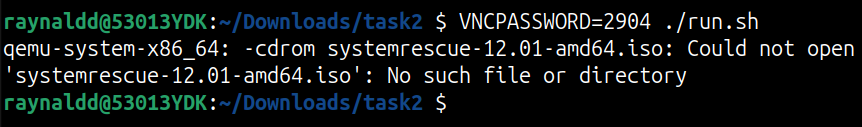
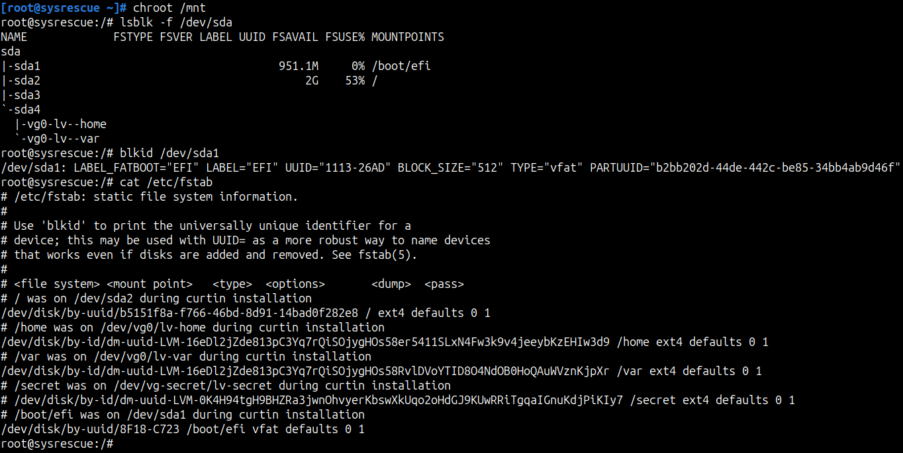

## Введение

Настоящий документ является структурированным отчетом с подробным описанием выполняемых действий в процессе решения ДЗ по лекции "Устройство и загрузка современного сервера". Выполнена Часть 1. 

ДЗ выполнено на ОС Ubuntu 24.04.2 LTS:


## Задание

1. Дан образ машины, в которой перед её выключением было затёрто начало диска, и она теперь не загружается. Пароль пользователя неизвестен. Нужно восстановить работоспособность системы и суметь в неё залогиниться.
2. Найти и получить секрет.

## Решение

### Часть 1. Восстановить систему

Запускаю скрипт run.sh согласно README и получаю ошибку отсутствия systemrescue-12.01-amd64.iso:



Скачиваю systemrescue-12.01-amd64.iso, SHA256 checksum и проверяю целостность образа:


Повторно запускаю скрипт run.sh, процесс захватывает текущий терминал:


Иду изучать каждый аргумент команды:

```
qemu-system-x86_64 -smp cores=4,threads=1 \
	-drive if=pflash,format=raw,readonly=on,file=OVMF_CODE_4M.ms.fd \
	-drive if=pflash,format=raw,file=OVMF_VARS_4M.ms.fd \
	-drive file=task2.img,format=qcow2 \
	-m 4096 -machine q35,smm=on \
        -nic user,hostfwd=tcp:127.0.0.1:2222-:22 \
	-vnc :1,password-secret=vncpw -object secret,id=vncpw,file=vncpassword,format=raw \
	-boot menu=on \
	-cdrom systemrescue-12.01-amd64.iso
```

- **`qemu-system-x86_64`**  
    Запускает эмулятор QEMU для архитектуры x86_64 (64-битные системы).

- **`-smp cores=4,threads=1`**  
    Настраивает SMP (Symmetric Multiprocessing):
    - `cores=4` — 4 физических ядра CPU.
    - `threads=1` — 1 поток на ядро (без Hyper-Threading).  
        Итого: гостевая ОС видит 4 логических процессора.

- **`-drive if=pflash,format=raw,readonly=on,file=OVMF_CODE_4M.ms.fd`**  
    Первый pflash-диск для UEFI-прошивки:
    - `if=pflash` — интерфейс эмуляции флеш-памяти UEFI.
    - `format=raw` — образ в сыром формате.
    - `readonly=on` — доступен только для чтения (защита прошивки).
    - `file=OVMF_CODE_4M.ms.fd` — файл UEFI-прошивки (код).
        
- **`-drive if=pflash,format=raw,file=OVMF_VARS_4M.ms.fd`**  
    Второй pflash-диск для переменных UEFI (NVRAM):
    - Переменные загрузки сохраняются здесь (без `readonly`).
    - `OVMF_VARS_4M.ms.fd` — образ для хранения настроек UEFI.
        
- **`-drive file=task2.img,format=qcow2`**  
    Основной виртуальный жесткий диск:
    - `file=task2.img` — образ диска гостевой ОС.
    - `format=qcow2` — формат QCOW2 (поддержка снимков, сжатия).
        
- **`-m 4096`**  
    Выделяет 4096 МБ (4 ГБ) оперативной памяти для гостевой системы.

- **`-machine q35,smm=on`**  
    Выбирает тип системной платформы:
    - `q35` — современная платформа с PCI Express (аналог Intel Q35 чипсета).
    - `smm=on` — включает System Management Mode (режим управления системой), критично для безопасности UEFI.

- **`-nic user,hostfwd=tcp:127.0.0.1:2222-:22`**  
    Настраивает сеть в режиме пользователя (NAT):
    - `hostfwd=tcp:127.0.0.1:2222-:22` — проброс порта:  
        Хост: `127.0.0.1:2222` → Гость: `22` (SSH).  
        Подключение к гостю: `ssh -p 2222 user@localhost`.
        
- **`-vnc :1,password-secret=vncpw`**  
    Включает VNC-сервер:
    - `:1` — дисплей 1 (порт 5901).
    - `password-secret=vncpw` — использует пароль из объекта `vncpw`.

- **`-object secret,id=vncpw,file=vncpassword,format=raw`**  
    Создает объект с паролем для VNC:
    - `id=vncpw` — идентификатор, связанный с `-vnc`.
    - `file=vncpassword` — файл с паролем в сыром виде (plain text).

- **`-boot menu=on`**  
    Включает меню загрузки при старте:
    - Позволяет выбрать загрузку с HDD, CD-ROM и т.д.
    - Особенно полезно с подключенным `-cdrom`.

- **`-cdrom systemrescue-12.01-amd64.iso`**  
    Подключает ISO-образ как CD-ROM:
    - `systemrescue-12.01-amd64.iso` — загрузочный диск для аварийного восстановления.

Открываю второй терминал, и согласно `-vnc :1,password-secret=vncpw` проверяю, что VNC-сервер слушает на порту 5901:


Устанавливаю remmina для управления запущенной виртуальной машиной (ВМ) по протоколу VNC:

`sudo apt install remmina -y`

Подключаюсь к ВМ:


Обращаю внимание на ошибку загрузки с диска (Ассеss Denied):


Проверяю в Boot Manager Menu включен ли SecureBoot:


Отключаю SecureBoot и перезагружаю систему. 
В меню GRUB выбираю загрузиться с параметрами по умолчанию:


SystemRescue 12.01 загружена, вход в систему выполнен под пользователем root:


Проверяю состояние ssh-сервера:


Проверяю состояние firewall:


Проверяю правила iptables и добавляю правило для SSH:


Устанавливаю пароль для root используя утилиту `passwd`

Подключаюсь с хоста на ВМ по SSH согласно правилу проброса портов при запуске qemu:


Смотрю информацию о дисках:


/dev/sda - интерсующий меня проблемный диск

Проверяю таблицу разделов:


Основная таблица повреждена, но резервная копия цела, перехожу к восстанавлению таблицы разделов:

Последовательно выбираю:

1 - Use current GPT

r - recovery and transformation options (experts only)

v	- verify disk


p - print the partition table


w	- write table to disk and exit

y - подтверждаю изменения

Смотрю информацию о /dev/sda:


/dev/sda1 - загрузочный раздел с файловой системой vfat

/dev/sda2 - корневой раздел с файловой системой ext4

Оцениваю состояние /dev/sda1 без внесения изменений и обнаруживаю повреждения загрузочного сектора, FSINFO-сектора и FAT-таблиц:


Восстановление файловой системы посредством утилиты fsck.fat не помогло (загрузочный сектор полностью повреждён), пересоздаю файловую систему:


Проверяю /dev/sda2, проблем нет:


Монтирую корневой и загрузочный разделы с жёсткого диска к файловой системе RescueCD:


Проверяю монтирование:


Выполняю chroot в собранную ФС и вижу, что UUID /dev/sda1 отличается от записи в /etc/fstab:



Правлю /etc/fstab:


Устанавливаю GRUB:


Размонтирую ФС:


Перезагружаю систему и включаю SecureBoot в Boot Manager Menu.

Войти в систему не удается, так как не знаю пароля.
Перезапускаю ВМ и запускаю меню GRUB:


Нажимаю 'e' и редактирую параметры ядра, заменяя ro на rw init=/bin/bash, и загружаю систему (Ctrl-x):


Вывожу список пользователей, задача - залогиниться под пользователем kit:


Меняю пароль у пользователя kit:


Перезагружаю систему:

`reboot -f`

Вхожу в систему под пользователем kit:


Проверяю, что SecureBoot включен, а также то, что примонтированы все незакомментированные в исходной системе ФС:


