## Введение

Настоящий документ является структурированным отчетом с подробным описанием выполняемых действий в процессе решения ДЗ по лекции "Внутренности linux". Выполнены Часть 1 и Часть 2. 

ДЗ выполнено на ОС Ubuntu 24.04.2 LTS:


## Задание

1. Я запустил в консоли важный сервис, но забыл запустить его в фоне... мне надо закрыть ноут и бежать на лекцию....

**Важный сервис**:

```
#! /usr/bin/bash

while true; do
  echo "`date` I am still alive"
  sleep 1
done
```

Задача - отвязать процесс от консоли и перенаправить вывод в файл чтобы 1 и 2 дескриптор писали в файлики stdout.txt и stderr.txt

Важное уточнение: сервис нужно запустить из обычной консоли без tmux/screen

Предпочтительно это сделать через GDB, но другие варианты тоже подойдут.

2. Собрать zstd с debug символами самостоятельно.

Запустить:

```
cat /dev/urandom | zstd -19 -f -T4 -v - -o out.zst
```

снять с процесса zstd perf record и найти в исходниках zstd самую нагруженную функцию.

## Решение

### Часть 1. Отвязать процесс от консоли

Cоздаю скрипт service.sh со соследущим содержимым (доработано с учетом вывода в STDERR):

```
#! /usr/bin/bash

while true; do
  echo "`date` I am still alive"
  echo "`date` Error simulation: something happened!" >&2
  sleep 1
done
```

Даю права на исполнение:

`chmod +x service.sh`

Запускаю скрипт:

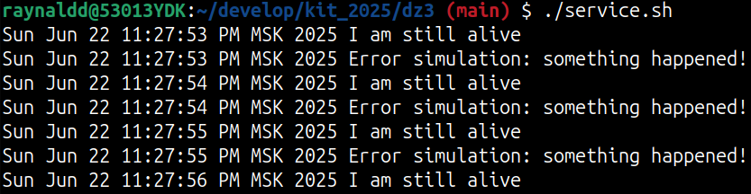

Открываю второй терминал и смотрю PID процесса service.sh:

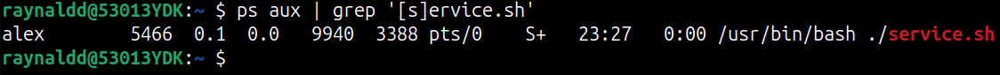

Подключаюсь в процессу через GDB:

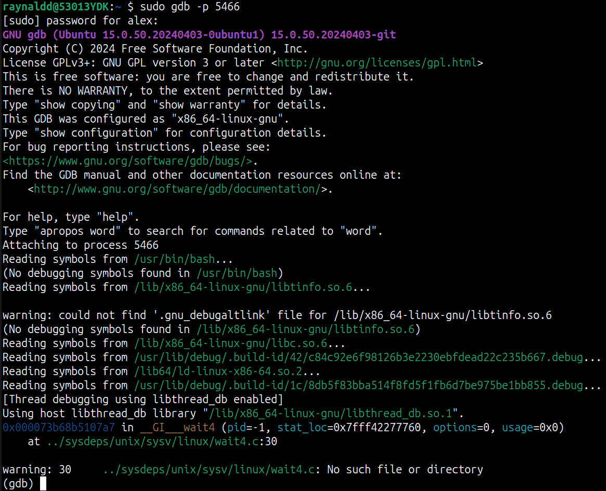

Перенаправляю STDOUT в файл stdout.txt и STDERR в файл stderr.txt

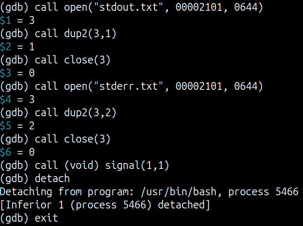
 
Пояснения:

call open("stdout.txt", 00002101, 0644) - открыть файл stdout.txt, возвращает номер открытого файлового дескриптора.

#define O_CREAT 00000100 - создать файл, если он не существует.
#define O_WRONLY 00000001 - открыть файл только для записи.
#define O_APPEND	00002000 - запись в конец файла (можно использовать #define O_TRUNC 00001000, чтобы чистить содержимое файла при каждом открытии).

0644 - права на чтение и запись для владельца файла, на чтение для остальных

call dup2(3,1) - перенаправить STDOUT (дескриптор 1) в открытый дескриптор 3 (stdout.txt). dup2(oldfd, newfd), возвращает номер newfd. 

call close(3) - закрыть дескриптор 3.

call open("stderr.txt", 00002101, 0644) - открыть файл stderr.txt, возвращает номер открытого файлового дескриптора.

call dup2(3,2) - перенаправить STDERR (дескриптор 2) в открытый дескриптор 3 (stderr.txt). dup2(oldfd, newfd), возвращает номер newfd.

call close(3) - закрыть дескриптор 3.

call (void) signal(1,1) - процесс игнорирует SIGHUP, то есть можно закрыть консоль и процесс продолжит исполняться (signal(int signum, void (*handler)(int)): signum = 1, т.е. SIGHUP, handler = 1, т.е. SIG_IGN).

detach -  отсоединить GDB от процесса

exit - выход из GDB

Закрываю консоль с процессом, проверяю, что процесс все еще исполняется и не привязан к терминалу, а его вывод перенаправлен в stdout.txt и stderr.txt:

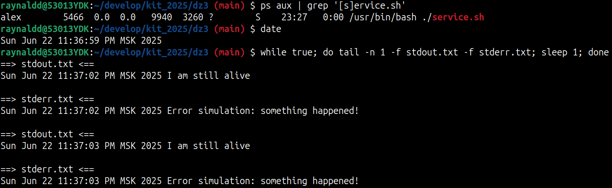

Теперь можно закрыть ноут и бежать на лекцию.

### Часть 2. Найти самую нагруженную функцию

Клонирую репозиторий zstd с github:

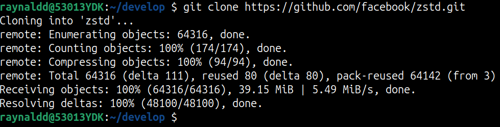

Изучаю Makefile, чтобы понять как собирать проект.

Собираю проект с дополнительным флагом:

`make MOREFLAGS="-g"`

-g - produce debugging information in the operating system's native format (stabs, COFF, XCOFF, or DWARF). GDB can work with this debugging information.

Смотрю по выводу директорию, в которой находится собранный бинарь:

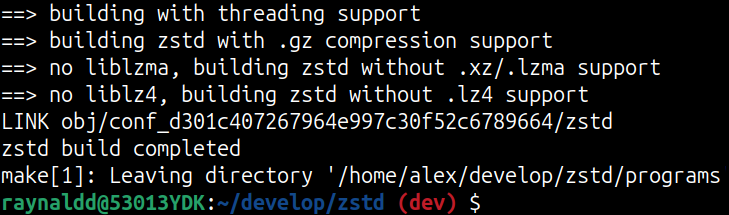

Перехожу в ./programs/ и нахожу собранный бинарь zstd:

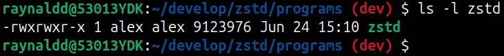

Запускаю команду, указанную в задании:

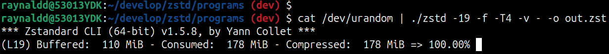

Узнаю PID запущенного процесса и снимаю с него perf record:

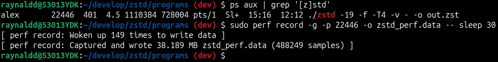

Смотрю perf report:

`perf report -i zstd_perf.data`

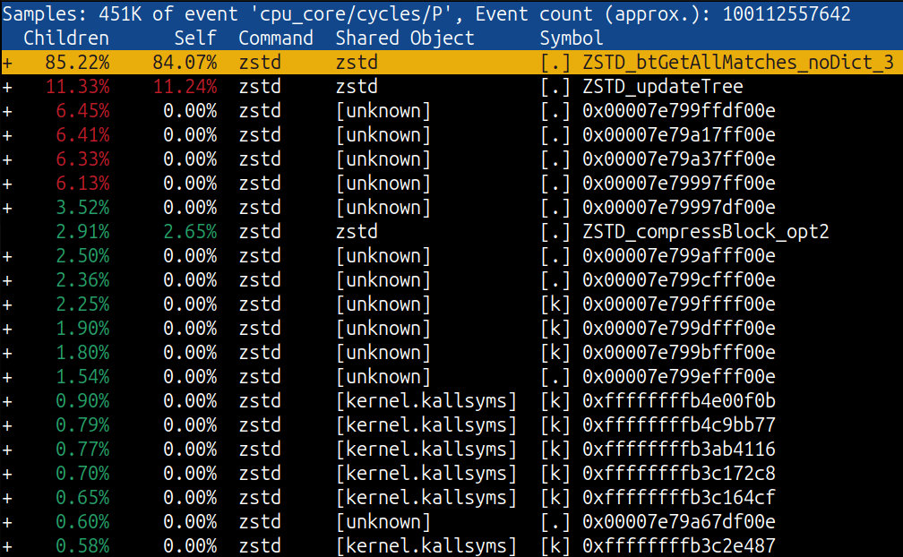

ZSTD_btGetAllMatches_noDict_3 - наиболее нагруженная функция в бинарном файле (84.07% времени CPU).

Ищу эту функцию в исходном коде zstd и ничего не нахожу:

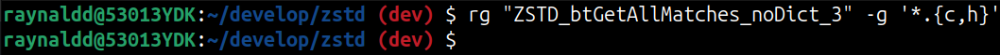

Запускаю собранный бинарь zstd в gdb, пытаюс узнать адресс ZSTD_btGetAllMatches_noDict_3 и информацию о строке исходного кода:

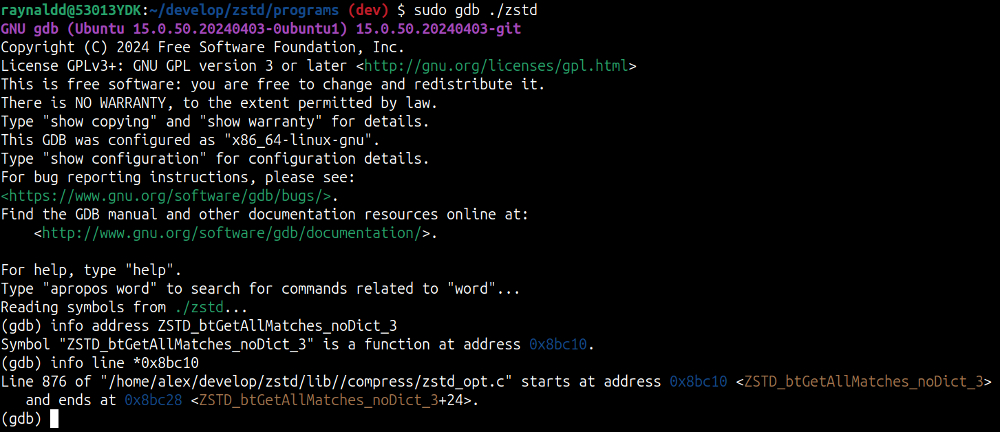

Искомый файл - zstd/lib/compress/zstd_opt.c, строка 876.

Анализирую файл zstd/lib/compress/zstd_opt.с:

На 876 строке находится макрос GEN_ZSTD_BT_GET_ALL_MATCHES(noDict), который, используя цепочку макросов, генерирует функцию ZSTD_btGetAllMatches_noDict_3, которая в свою очередь вызывает ZSTD_btGetAllMatches_internal(), которая вызывает ZSTD_insertBtAndGetAllMatches(), выполяющую поиск совпадений в процессе выполнения алгоритма сжатия.

Алгоритм поиска совпадений ZSTD_insertBtAndGetAllMatches() вызывается для каждого блока данных при сжатии, работает с хеш-таблицами и бинарными деревьями (в зависимости от стратегии), что требует операций O(n) или O(log n) на каждом шаге.

Функция имеет атрибуты FORCE_INLINE_TEMPLATE (принудительно пподставляется в место вызова и может специализироваться для разных типов данных или параметров) и ZSTD_ALLOW_POINTER_OVERFLOW_ATTR (нет проверок на переполнение).

Таким образом самая нагруженная функция в исходниках zstd:

```
ZSTD_insertBtAndGetAllMatches (
                ZSTD_match_t* matches,  /* store result (found matches) in this table (presumed large enough) */
                ZSTD_MatchState_t* ms,
                U32* nextToUpdate3,
                const BYTE* const ip, const BYTE* const iLimit,
                const ZSTD_dictMode_e dictMode,
                const U32 rep[ZSTD_REP_NUM],
                const U32 ll0,  /* tells if associated literal length is 0 or not. This value must be 0 or 1 */
                const U32 lengthToBeat,
                const U32 mls /* template */)
```
